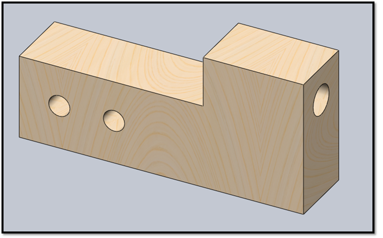
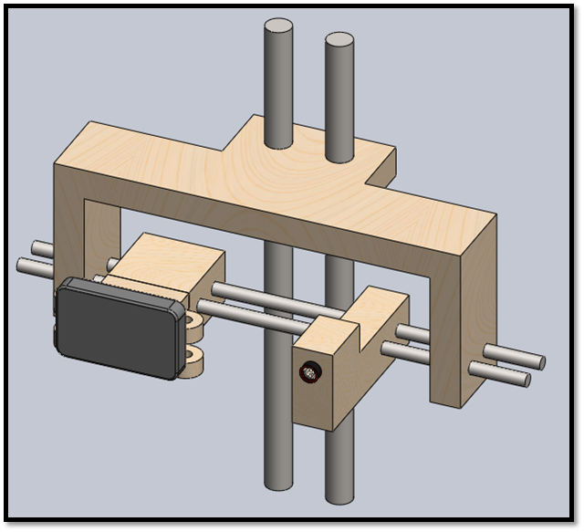
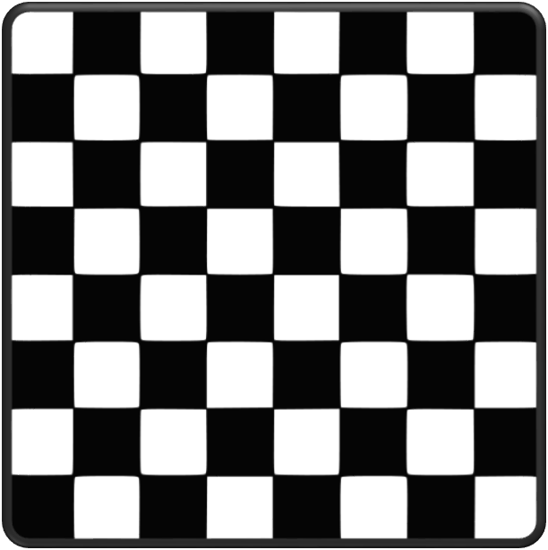
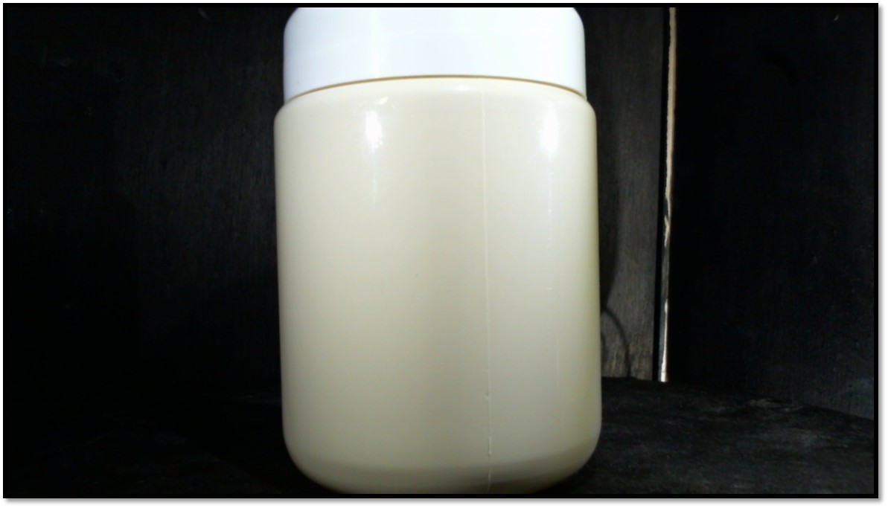
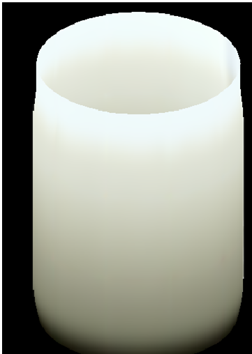
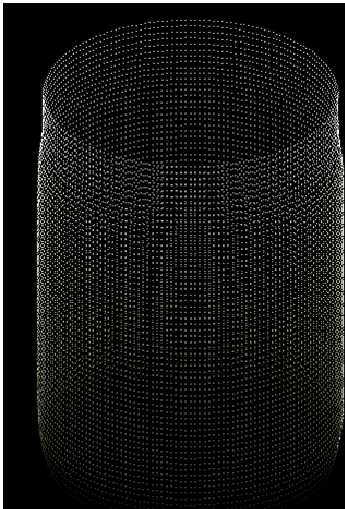

# 3D-Scanner
3D Scanner built with C++ and openCV

This is a 3D Scanner built in C++ using **Open CV** library  and **OpenGL**

# Materials

**Mechanical Design** 	
To build the 3D scanner we used a wood disk with a radio of 150 mm to
place the object, there is an orifice in the middle of the disk where the axis of the motor will be placed 

***Camera Hook***
This is where the camera will be placed with screws 

***Laser Hook***
Used to placed the laser
 
	
***Slider***
This is build to slid the camera and the lase in the right angle 

***Ensemble***
How the ensemble piece looks like 

	
**Electronic Design**

***5v and 12v Power source***
We need a 5v source to power the LEDs and 12v for the stepper motor circuit
***Driver for stepper motor***
We used the L283D
**Relay circuit**
We used relay circuit to turn on/off the LEDs to take color pictures of the elements we were scanning

**A bit of theory **

For the 3D scanner we used the triangulation method if you know the distance between the camera and laser

Once we get all the points we used Bezier Surface to reconstruct the element we wanted to scan

## Calibration

 Pattern utilized for calibration of the camera, each square is 5 mm x 5mm
 
 

**Skelotonized image of calibration**

 

Coordenates calculation

Transformation distance from pixel to millimeter 

Radio of profile 

Conversion factor from pixels to milimeters (experimental)

conversion from pixel to mm

Height of profile

 
## Results

Image without processing
 

Scan Result 

Point plastic 

